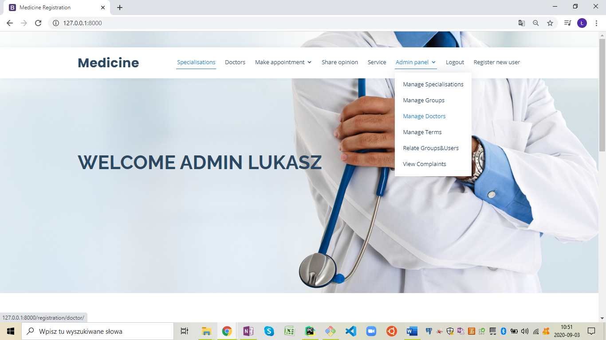
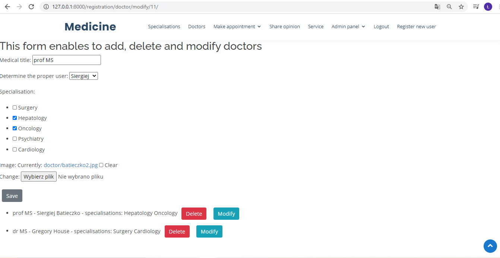
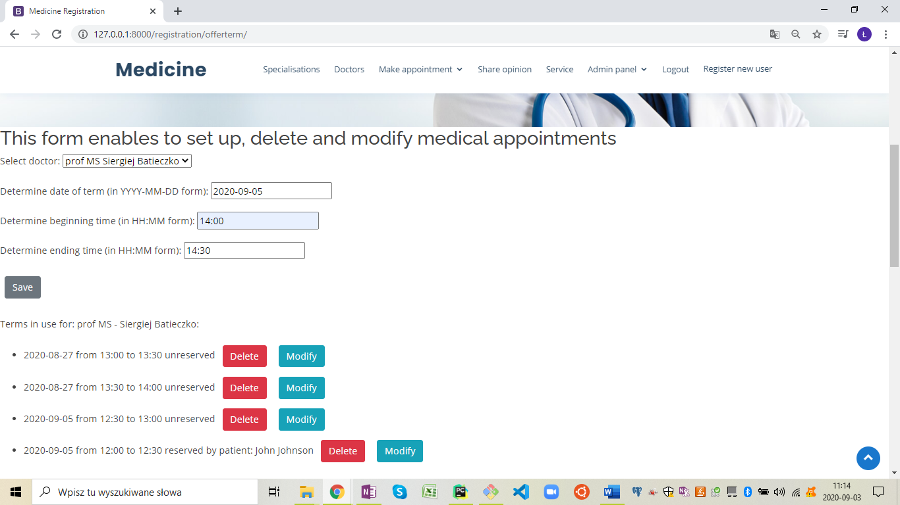
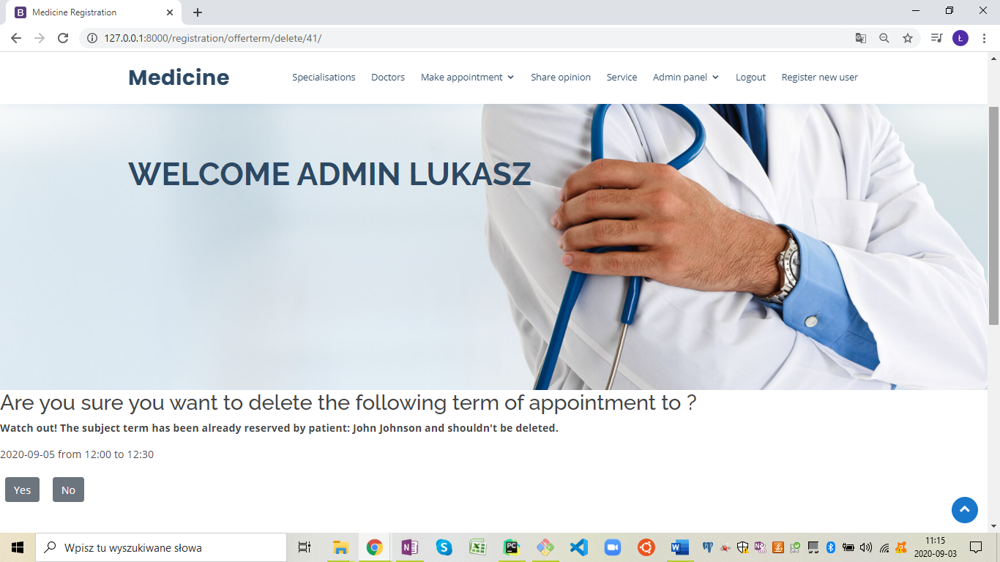
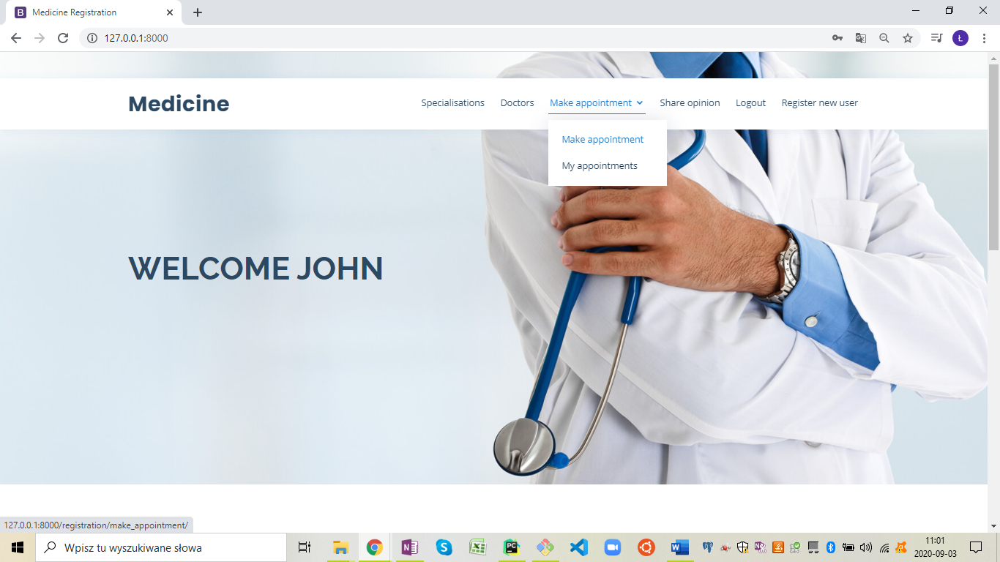
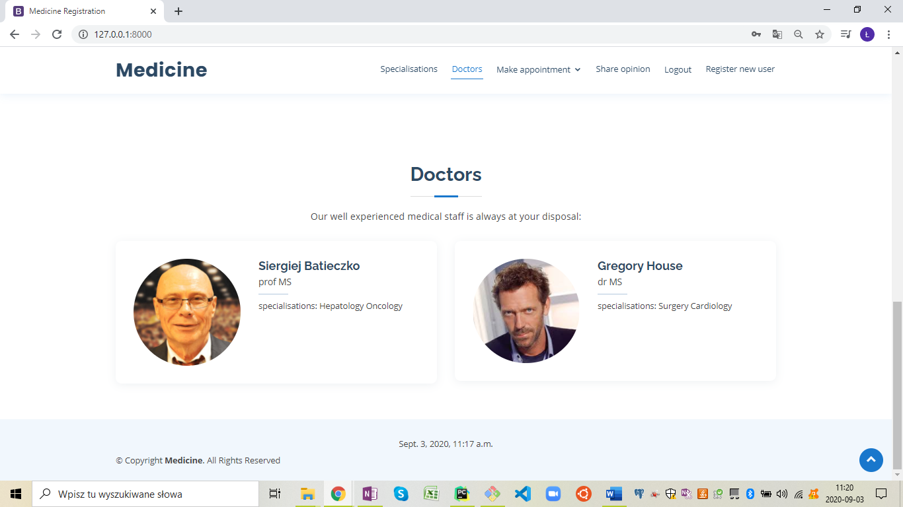
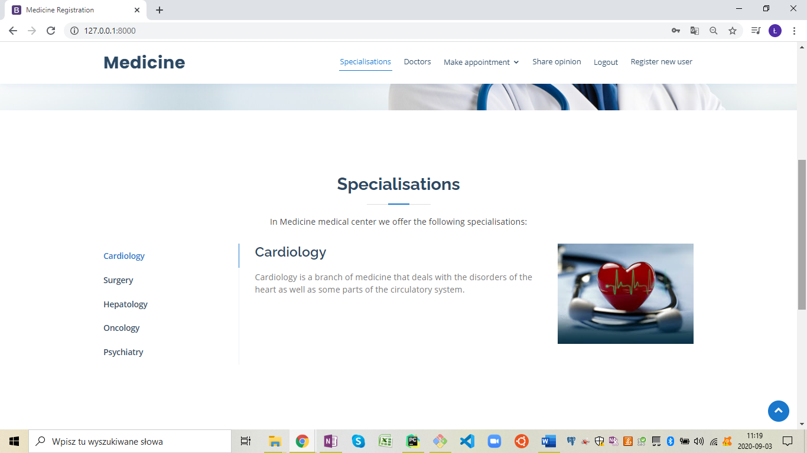
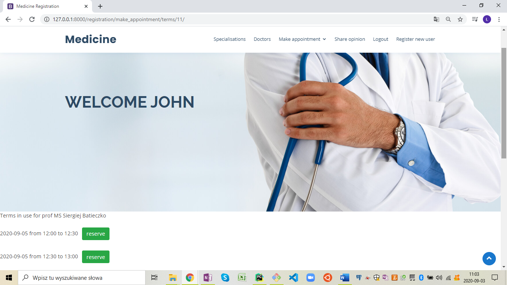
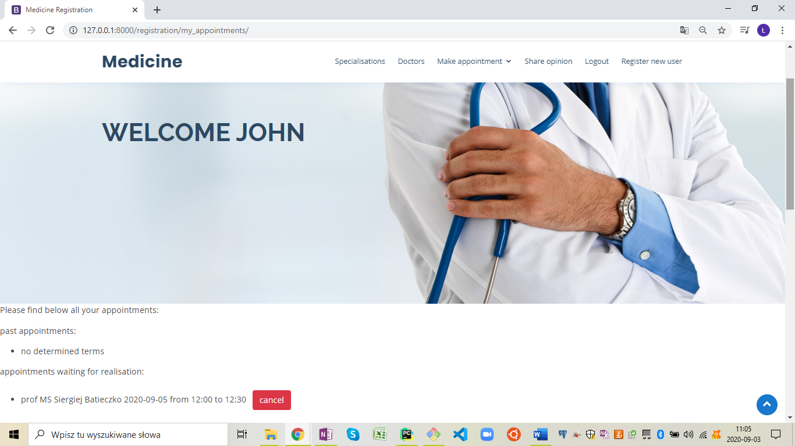

# Medicine Registration - register app

### Python web application prepared to maintain database with functionalities for medical center

## Table of contents

* [General infor](#general-info)
* [Technologies](#technologies)
* [Screenshots](#screenshots)
* [Status](#status)

## General info

The app was created ass final project after 3 months Python Developer course in Coders Lab IT school. The main aim was to sum up skills in Django and many others.

Medicine Registration is the web application with functionalities typical for medical center (medical registration) and every similar business.

The Medicine Registration application allows:

* for administrator (superuser):
    * add, modify and delete specialisations available in the medical center with picture field (list of available specialisations is presented with loaded pictures 
        and descriptions in the website) [link](admin_panel_screenshot)
    * add, modify and delete medical staff available in the medical center with picture field (list of available medical staff with related specialisations is presented 
        with loaded pictures and descriptions in the website)
    * add, modify and delete groups of users
    * add and delete realtions between registered users, groups of users and medical specialisations (medical staff exists as related group of registered users)
    * add, modify and delete available terms of appointments for every doctor (with appropriate date and time of appointment) - the dedicated view also presents information 
         whether particular term is reserved and information about related user tied with the appointment in case the amdinistrator would like to modify or delete the term - the date and time fields are equiped with set of validations enabling the proper data as for example: beginning time can not occure after the ending time, the date 
         can not occure as previous in comparison with the present date, two appointments to the same doctor can not occure in the same date and time
    * view list of opinions send by users/patients with information about related user, doctor and appointment - (pagination was applied)

* for user/patient:
   * create user profile
   * login/logout
   * make appointment with chosen doctor in desired term, appropriately cancel the reserved term (current and future terms with status: unreserved and are listed only)
   * create opinion related with the appropriate appointment (appointments)

## Technologies

* Bootstrap 4
* Python 3.8.3
* Django
* pytest-django, psycopq2-binary, pytz
* postgres
* IDE (PyCharm)

The application bases on the database created in the postgres. The app was created in Django with many different technics applied creating forms, models and views (generic 
and straight classic views and generic forms with applied widgets and validations). The app includes tests exercising created fixtures. 
The app is based on the modified Bootstrap's template.

## Screenshots

## Status

The project is _in progress_. The next step in planned development of the application is to create functionality for medical staff to prepare short note related to each appointment, development of test,
multiply relations between views and urls to improve accessibility of applied functionalities and many others waiting for iplementation :)

